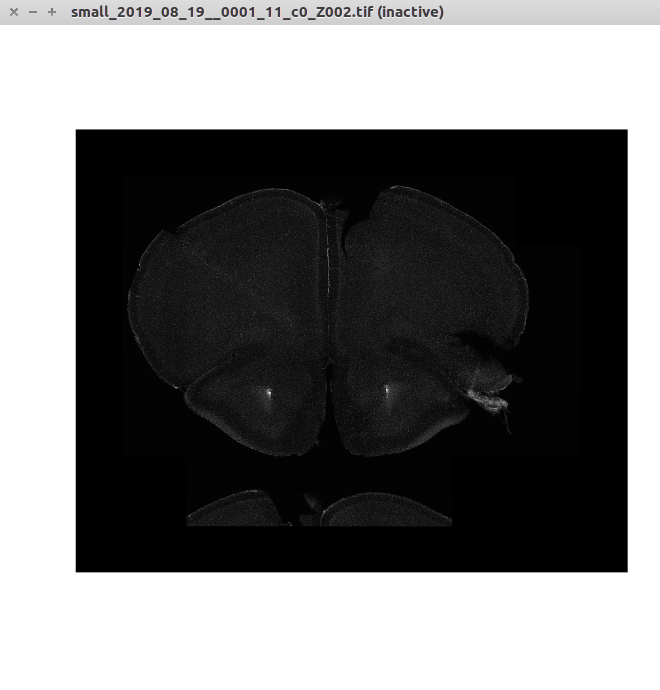
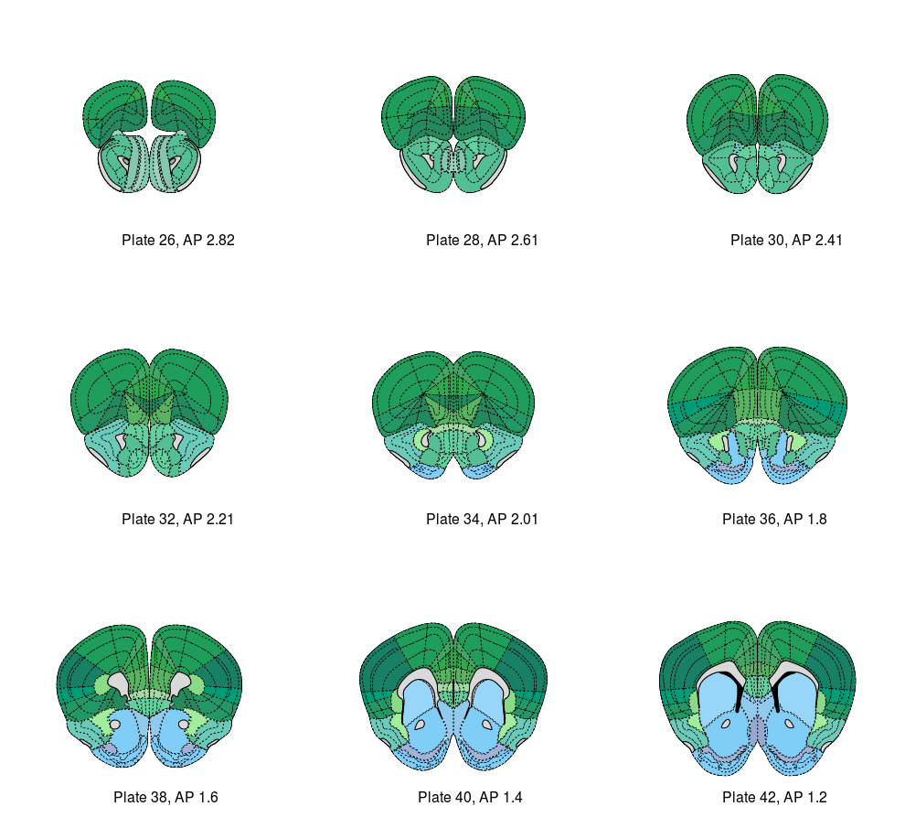
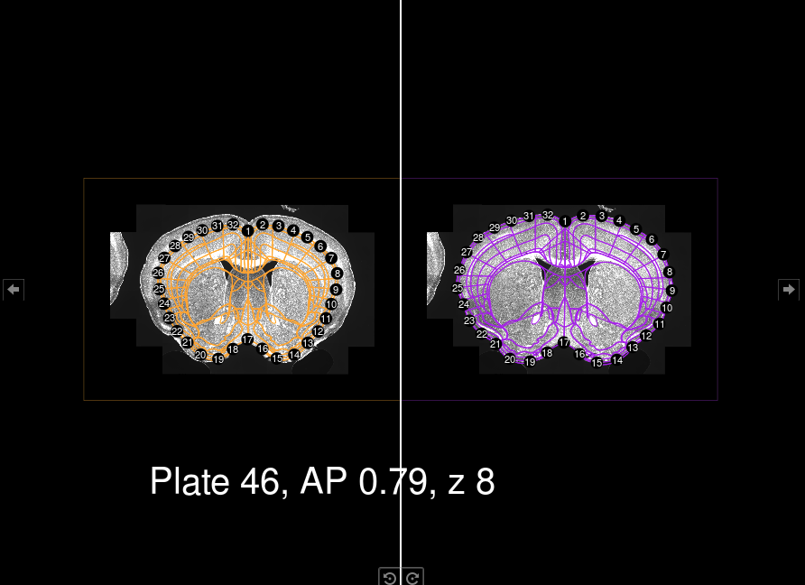

# Introduction

This document is useful to have a self-contained explanation of the pipeline used to analyze the cFos for the Monogenic (MG) project. Hopefully it works to help keep organized the many files/stages involved in this experiment.

## Tree structure

We will be working with a tree structure that looks like this

```
.
├── MG847
├── MG884
├── MG886
├── MG889
├── MG927
├── MG952
└── ...
```

Briefly:

* `raw_data` will have animal folders by name
* Each animal folder will contain the `.czi` files and a number of folders created by the pipeline.
  * `c0` ->> DAPI (registration channel)
  * `c1` ->> cFOS (segmentation channel)
  * `c2` ->> if needed
  * `composites` will have the `.tiff` composites (2 or 3 channels). 

# File naming

Files are named with this general pattern

# Pipeline 

## 01-workflow.R

### .czi to .tif

Images come from the scanning microscope in `.czi` format. They might have 2 or 3 channels (DAPI and cFos is the standard).  
They should be kept in a folder named by the corresponding *animal_id* (see folder structure).

The script `batch_czi_to_tiff.ijm` will ask for folder where `.czi` images are stored. It takes quite a while to export all images. 

> **CAUTION:** For some reason, images are repeated. You will find the same image at many resolutions. Sort by name, and only choose the ones with high size (>500 MB).

### Manual move

Create a folder named `001` and move all big `.tif` files there.

### Rename and call python

Now, you can continue with the pipeline. 

First, it will rename files (removing some extra tags that the `batch_czi_to_tiff.ijm` script adds). Second, it will call a python script named `batch_composite_to_single_tiff.py` to separate files into proper channels, creating proper folders to contain them (i.e., `c0`, `c1`, ...). 

This step takes between 5 and 10 minutes and a progress bar will show the processing.

The call to python currently uses this python.

> "/home/mike/miniconda3/bin/python" 

It might fail when executed from another computer, so, from command line:

```
which python
```
Adjust python commands properly.

## 02-workflow.R

This script is the bulk of processing, with several steps of manual processing.

Choose the folder of the animal you are working with.

### C0 -> resize_pad

We need to resize our images (make them smaller, add padding). This takes some minutes per animal and it will print progress to console. The base function is `resize_pad.R`. It will save output into a folder called `small`.

### small -> find_contours

From the small images, we can read and find the biggest contour using `find_contours.R`. We will use these contours to pass to the `registration` functions.

### Manual Setps: Match images to atlas plate

The following command will prompt the user to match the images to Atlas

```{r, eval=FALSE}
# image folder being the place where the small DAPI images are
image_folder <- file.path(root_path, "small")
match_df <- match_image_to_atlas(image_folder)
```

It will display the original small image and an equalized one (know shown).

```{r, echo=FALSE}

```


It will prompt the user with:

```
what is your first guess for AP level? :> 
```

And call `pull_atlas` around that AP level (example shown for AP = 2).

```{r, echo=FALSE}

```

It will prompt user with options:

```
+++++++++++++++++++++++++
Please see your options below:
+++++++++++++++++++++++++
Option 1) 2.82
Option 2) 2.61
Option 3) 2.41
Option 4) 2.21
Option 5) 2.01
Option 6) 1.8
Option 7) 1.6
Option 8) 1.4
Option 9) 1.2

Use numbers to select the option that best fits your image :>
```
And loop for decision making.

The result is an object of class `data.frame` with 2 columns:

```{r, eval = FALSE}
names(match_df)
```
[1] "image_file"     "mm.from.bregma"

We could have matched 2 images to the same AP level. Moreover, we could have made a mistake during the assignment. Thus, we use the function `inspect_AP_match` to check for duplicates and make sure all assignments were correct.

This function will show you the image and the `pull_atlas(AP)` for the AP you selected during the previous matching. It will prompt you to solve incorrect assignments and duplicates.

Now we are ready to rename our images with a `Z` number that indicates the order from anterior to posterior. This is needed for the SMART pipeline to work.

> **CAUTION:** We chose not to duplicate files to save space. Thus, once you rename with a Z plane, the files will no longer be able to be read by the previous steps that rely on the original file path. 

The function call is 
```{r, eval=FALSE}
match_df_2 <- rename_AP(match_df_2)
```

We get a new `data.frame`, similar to the previous one, and files get renamed properly. 

### Create setup object

`SMART` is built around a `setup` object that gets created with `setup_pl()` and modified by a family of functions. We can by-pass that by direct assignment of values (For this case, it's easier this way).

We know reorder the lists of contours and matched images so that they are fed in the proper order to the pipeline.

### Automatic + Manual Registration 

This is done using `regi_loop` and it takes a while. It might make errors, so we have to later inspect the images. There is a helper function that we can call by doing:

```{r, eval=FALSE}
plates <- inspect_wrong_regi_plates(setup)
```

This will show the registration files living in the folder `registration_auto` and `registration_manual` (if you happen to already done some manual registration)

```{r, echo=FALSE}

```

It will prompt the user to define whether they want to perform manual registration on that image or not. At the end of the loop, the object `plates` will hold all the plates that need to be registered manually. Thus, the following call will perform manual fix of selected plates:

```{r, eval=FALSE}
# Manual fix of registration ####
regi_loop(setup, regis = regis,
          touchup = plates, brightness = 20,
          filter = ordered_filter_list, autoloop = FALSE)
```

Changes will be saved onto the `regis` object created by `regi_loop`.

### Get contours

Now we have all contours. We need to extract them from the `regis` object and select those of our interest. We use `prep_data` function and a series of subsetting/renaming calls to perform these steps.

We also match them with the `EPSatlas.RData` coming from `wholebrain`. This `data.frame` contains all the naming conventions that we need to be able to get our regions of interest.

The fundamental part is selecting the correct acronyms. Below, there's an example for 5 "parent" regions. We will get all the "children" for them and use them to filter our contour list. 

```{r,eval=FALSE}
# We need to translate from acronym to structure_id
# We have to choose the parents of the structures we care about and use a recursive get children
# This comes from SMART package
rois <- get_all_children(c("ILA", "PL", "BLA", "MOp", "SSp"))
```

 
Finally, all contours of interest will be saved as `data.frames` in a folder called `contours`. This will be done as 1 `.csv` file per image.

## 03-workflow.R

Now that we have the contours of interest we can prepare the python call to make the croppings. Croppings are made by a series of functions inside `read_large.py`. They will read the original size images (stored in c0, c1, ...), rescale the regions of interest to the original size and perform cropping.

The croppings will be moved by an R function called `move_crops`. This call will be inside a for loop of each channel 

```{r ,eval=FALSE}
for(i in 1:length(c0_files)){
  # make the call by pasting arguments c0
  # system(...)
  # move_crops()
  
  # make the call by pasting arguments c1
  # system(...)
  # move_crops()

}
```

This is quite verbose, so the user should be able to follow. Progress will be printed.

> To make sure the contours are properly rescaled, it might be good to call this function with `-display_contours True` at least in c0 channel. This is currently not working perfectly from command line (all contours/crops will be displayed) and it will slow down computation.

### Merge crops into composite channels


### Save training and test data

We get all the images and group them by region.
Because the partition is not reproducible (involving `sample_frac()`), we save the partition list to be able to later follow what happened (i.e., what image went where). We can put all the images back by reversing the `rename.files()` call to move files back from the `training/testing` folder to the `composites` folder. 